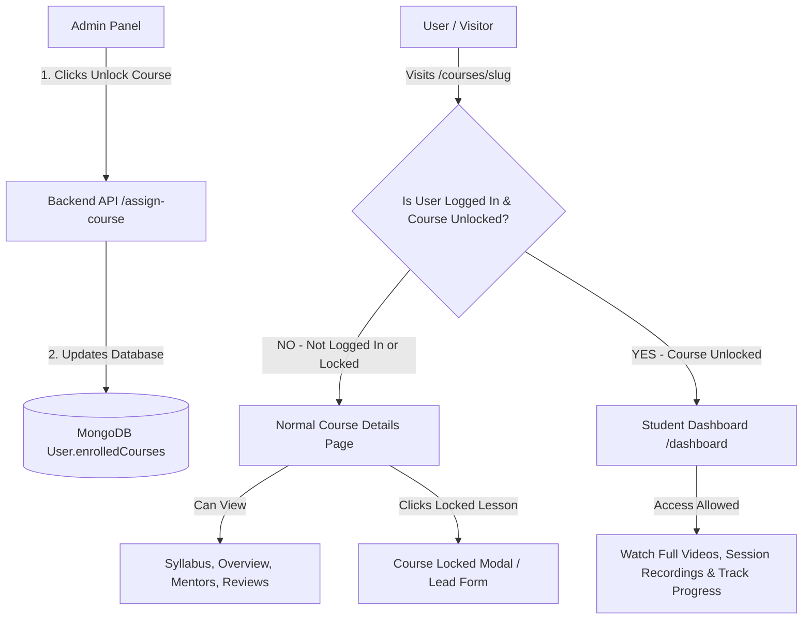

# 🎓 Course Unlock, Access Control & Student Dashboard Architecture

Is document me **Weekend UX** platform ke **Course Locking, Admin Unlocking Mechanism, Backend APIs, aur Student Dashboard Flow** ko step-by-step code examples ke saath explain kiya gaya hai.

---

## 🏗️ 1. Complete Flow Overview



---

## 🗄️ 2. Database Model (`backend/models/Auth.js`)

Har user document me `enrolledCourses` ka array hota hai jo unlocked courses aur lesson progress store karta hai.

```javascript
// backend/models/Auth.js
import mongoose from "mongoose";

const userSchema = new mongoose.Schema(
  {
    name: { type: String, required: true },
    email: { type: String, required: true, unique: true, lowercase: true },
    password: { type: String, required: true, select: false },
    enrolledCourses: [
      {
        courseId: {
          type: mongoose.Schema.Types.ObjectId,
          ref: "Courses",
        },
        courseSlug: { type: String },
        enrolledAt: { type: Date, default: Date.now },
        progress: { type: Number, default: 0 },
        completedLessons: [mongoose.Schema.Types.ObjectId],
      },
    ],
  },
  { timestamps: true }
);

export default mongoose.models.User || mongoose.model("User", userSchema);
```

---

## 👑 3. Admin Panel: Course Unlock & Lock APIs (`backend/controllers/adminController.js`)

Admin Panel se kisi student ke liye course unlock (`assignCourseToUser`) ya revoke (`revokeCourseFromUser`) karne ke liye yeh APIs use hoti hain:

### A. Course Unlock API (`assignCourseToUser`)
```javascript
export const assignCourseToUser = async (req) => {
  try {
    const connectDB = (await import("../config/db.js")).default;
    const User = (await import("../models/Auth.js")).default;
    const Courses = (await import("../models/Courses.js")).default;
    await connectDB();

    const { userId, courseId } = await req.json();

    if (!userId || !courseId) {
      return NextResponse.json({ error: "Please provide userId and courseId" }, { status: 400 });
    }

    const user = await User.findById(userId);
    if (!user) {
      return NextResponse.json({ error: "User not found" }, { status: 404 });
    }

    const coursesDoc = await Courses.findOne().lean();
    const allCourses = coursesDoc?.course || [];
    const targetCourse = allCourses.find(
      (c) => c._id?.toString() === courseId.toString() || c.slug === courseId.toString()
    );

    const targetIdStr = targetCourse?._id?.toString() || courseId.toString();
    const targetSlugStr = targetCourse?.slug || courseId.toString();

    // Check if already unlocked
    const alreadyEnrolled = user.enrolledCourses.some((item) => {
      const itemCId = item.courseId?.toString();
      return itemCId === targetIdStr || (targetSlugStr && item.courseSlug === targetSlugStr);
    });

    if (!alreadyEnrolled) {
      user.enrolledCourses.push({
        courseId: targetIdStr,
        courseSlug: targetSlugStr,
        enrolledAt: new Date(),
        progress: 0,
      });
      await user.save();
    }

    return NextResponse.json({
      success: true,
      message: "Course unlocked/assigned for user successfully",
    });
  } catch (error) {
    return NextResponse.json({ error: error.message }, { status: 500 });
  }
};
```

### B. Course Lock / Revoke API (`revokeCourseFromUser`)
```javascript
export const revokeCourseFromUser = async (req) => {
  try {
    const connectDB = (await import("../config/db.js")).default;
    const User = (await import("../models/Auth.js")).default;
    await connectDB();

    const { userId, courseId } = await req.json();

    const user = await User.findById(userId);
    if (!user) return NextResponse.json({ error: "User not found" }, { status: 404 });

    user.enrolledCourses = user.enrolledCourses.filter((item) => {
      const itemCId = item.courseId ? item.courseId.toString() : "";
      return itemCId !== courseId.toString();
    });

    await user.save();

    return NextResponse.json({
      success: true,
      message: "Course revoked/locked for user successfully",
    });
  } catch (error) {
    return NextResponse.json({ error: error.message }, { status: 500 });
  }
};
```

---

## 🔐 4. User Frontend Access Control (`UserAuthContext.js`)

Frontend me `UserAuthContext` me `isCourseUnlocked` method check karta hai ki logged-in user ke pass us course ka access hai ya nahi:

```javascript
// user/src/context/UserAuthContext.js
export function UserAuthProvider({ children }) {
  const [user, setUser] = useState(null);
  const [loading, setLoading] = useState(true);

  const isCourseUnlocked = useCallback((course) => {
    if (!user || !user.enrolledCourses || !Array.isArray(user.enrolledCourses)) {
      return false;
    }
    if (!course) return false;

    const targetId = (course._id || course.id || "").toString().toLowerCase();
    const targetSlug = (course.slug || "").toString().toLowerCase();

    return user.enrolledCourses.some((item) => {
      if (!item) return false;
      const itemCourseId = item.courseId;
      const itemCourseSlug = (item.courseSlug || "").toString().toLowerCase();

      // Check ID or Slug match
      if (typeof itemCourseId === "string") {
        if (targetId && itemCourseId.toLowerCase() === targetId) return true;
      }
      if (itemCourseSlug && targetSlug && itemCourseSlug === targetSlug) return true;

      // Populated Object Check
      if (itemCourseId && typeof itemCourseId === "object") {
        const cId = (itemCourseId._id || "").toString().toLowerCase();
        const cSlug = (itemCourseId.slug || "").toString().toLowerCase();
        if (targetId && cId === targetId) return true;
        if (targetSlug && cSlug === targetSlug) return true;
      }

      return false;
    });
  }, [user]);

  return (
    <UserAuthContext.Provider value={{ user, isLoggedIn: !!user, loading, isCourseUnlocked }}>
      {children}
    </UserAuthContext.Provider>
  );
}
```

---

## 🌐 5. User Page Flow: Locked vs Unlocked Experience

### A. Locked Course / Non-Logged-in User (`/courses/[slug]`)
- **No Login Required**: Visitor bina login kiye public Course Details page dekh sakta hai (Overview, Modules list, Mentors, Reviews).
- **Access Protection**: Closed/locked modules par lock icon 🔒 dikhta hai.
- **Action**: User agar locked content par click kare toh `CourseLockedModal` khulta hai jo user ko Enquiry ya Auth Modal ki taraf direction deta hai.

```jsx
// user/src/components/CourseLockedModal.jsx
export default function CourseLockedModal({ isOpen, onClose, course }) {
  if (!isOpen) return null;

  return (
    <div className="fixed inset-0 z-50 flex items-center justify-center bg-black/50 backdrop-blur-sm p-4">
      <div className="bg-white rounded-2xl p-6 w-full max-w-md text-center space-y-4">
        <div className="w-16 h-16 bg-amber-100 text-amber-600 rounded-full flex items-center justify-center mx-auto">
          <Lock size={32} />
        </div>
        <h3 className="text-xl font-bold">Course Locked 🔒</h3>
        <p className="text-sm text-zinc-600">
          This course is locked for your account. To buy and unlock full access, please enquire with our team.
        </p>
        <button
          onClick={() => window.location.href = "/contact-us"}
          className="w-full py-3 bg-zinc-900 text-white font-bold rounded-xl"
        >
          Enquire Now
        </button>
      </div>
    </div>
  );
}
```

---

### B. Unlocked Course User Experience (`/dashboard`)
- **Direct Student Dashboard**: Course unlock hone par student `/dashboard` par jate hi apne unlocked courses aur session recordings dekh sakta hai.
- **Embedded Video Player**: YouTube, Vimeo, Loom & Google Drive video links integrated embedded player me smooth play hote hain.

```jsx
// user/src/app/dashboard/page.jsx (Snippet)
export default function StudentDashboardPage() {
  const { user, isLoggedIn, loading: authLoading, isCourseUnlocked } = useUserAuth();

  // Auth Protection for Dashboard
  if (!authLoading && !isLoggedIn) {
    return <p>Please login to access student dashboard.</p>;
  }

  // Filter only unlocked courses for the logged-in student
  const myUnlockedCourses = coursesData?.filter((course) => isCourseUnlocked(course)) || [];

  return (
    <div className="min-h-screen bg-[#FCFBF7] p-6">
      <h1 className="text-2xl font-bold">Welcome back, {user?.name}!</h1>

      {myUnlockedCourses.length === 0 ? (
        <div className="p-8 text-center bg-white rounded-xl">
          <p>You haven't unlocked any courses yet.</p>
          <a href="/courses" className="text-amber-600 font-bold underline">Explore Courses</a>
        </div>
      ) : (
        <div className="grid grid-cols-1 md:grid-cols-2 gap-6 mt-6">
          {myUnlockedCourses.map((course) => (
            <HorizontalCourseCard key={course._id} course={course} isUnlocked={true} />
          ))}
        </div>
      )}
    </div>
  );
}
```

---

## 🎯 Summary Matrix

| User State | Course Status | Page URL | Action/Result |
| :--- | :--- | :--- | :--- |
| **Not Logged In** | Locked | `/courses/ui-ux-design` | Normal Course Details page (Syllabus preview + Lead form) |
| **Logged In** | Not Purchased / Locked | `/courses/ui-ux-design` | Normal Course Details + `CourseLockedModal` popup on video click |
| **Logged In** | Unlocked by Admin | `/dashboard` | Student Dashboard access ➔ Full videos, curriculum & progress tracking |
| **Admin** | Managing Users | Admin Panel | Admin single-click me user account ke liye course Unlock/Lock kar sakta hai |
